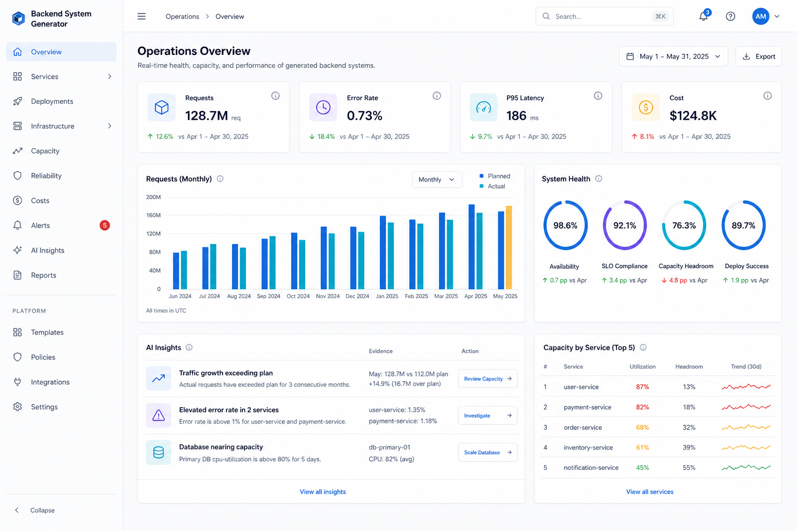
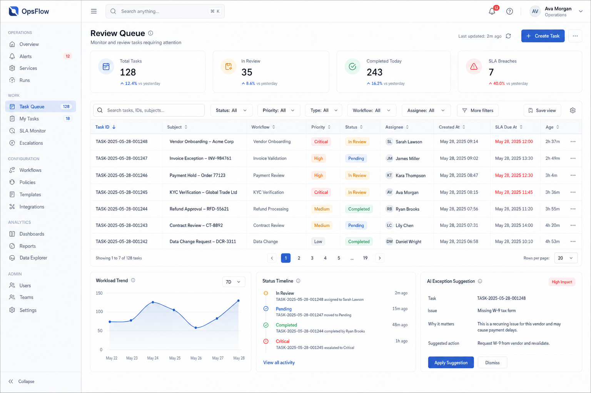
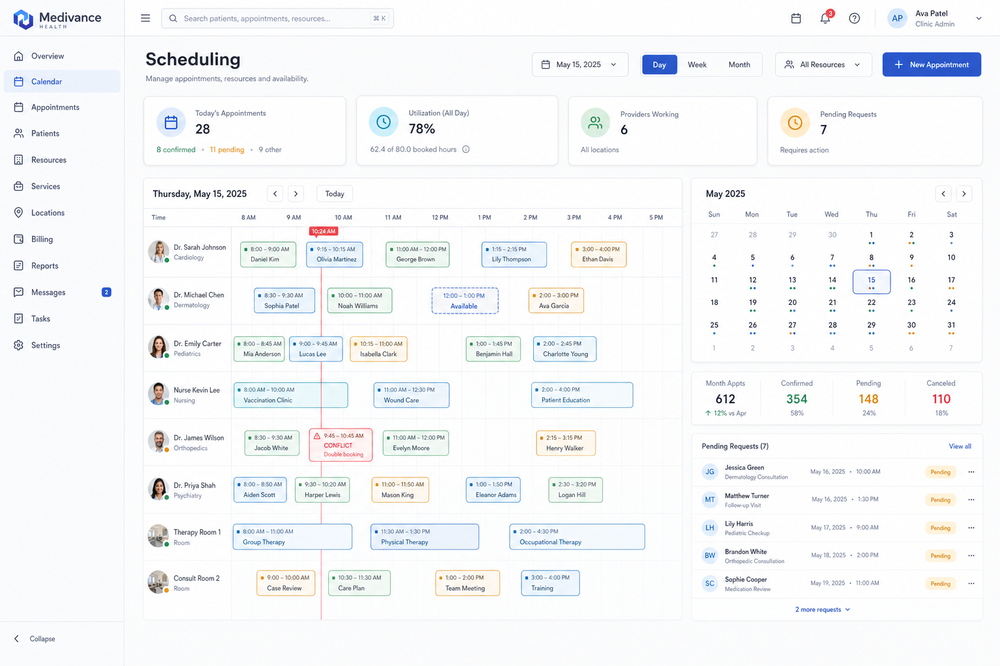

# Backend System Generator

用于生成、改造和审核成熟 SaaS 与数据后台系统的 Agent Skill，可安装到 Codex 和 Claude Code。

它面向经营仪表盘、数据分析、内容管理、用户与权限、订单与资源、任务队列、排期日历、人员管理和配置中心等场景，目标是建立一套“高信息密度、低视觉焦虑、多页面一致”的后台设计语言。

## 示例预览

以下图片用于测试和展示 skill 的默认浅色主题。界面品牌、人物、业务对象和指标均为模拟内容，不对应真实系统或真实个人。

### 经营总览



经营总览模板：四项 KPI、月度比较图、环形 KPI、AI 洞察和容量排名。

### 高密度任务队列



高密度队列模板：筛选工具条、可扫读表格、语义状态、负荷趋势、处理时间线和 AI 例外建议。

### 时间调度



时间调度模板：日时间线、资源轨道、月历、汇总指标、可预订时段和冲突提示。

## 能做什么

- 新建或重构 Dashboard、Detail、Scheduling、Queue、Resource、Analytics、Settings 等后台页面。
- 在保留原始信息与业务结构的前提下统一页面视觉和交互。
- 设计 KPI 卡、表格、筛选器、月历、时间线、容量进度和 AI 洞察模块。
- 为趋势、比较、构成、进度、排期与流程选择合适的图表表达。
- 审核 HTML、React、Vue、Tailwind 或设计稿是否符合统一设计系统。
- 提供浅色或深色单主题方案，并保持全局组件、浮层和状态语义一致。

## 安装

这个仓库使用标准 `SKILL.md` + 支持文件结构，可同时被 Codex 和 Claude Code 使用。推荐先克隆仓库，再运行安装脚本；脚本只复制运行时需要的文件，不会把 README 和预览图片塞进 skills 目录。

### 推荐：安装脚本

```bash
git clone https://github.com/sxt417/backend-system-generator.git
cd backend-system-generator
```

只安装到 Codex：

```bash
./install.sh codex
```

只安装到 Claude Code：

```bash
./install.sh claude
```

同时安装到 Codex 和 Claude Code：

```bash
./install.sh all
```

安装为某个项目专用的 Claude Code skill：

```bash
./install.sh claude-project /path/to/project
```

### 默认安装位置

| 客户端 | 作用域 | 安装位置 | 调用方式 |
|---|---|---|---|
| Codex | 个人 | `~/.codex/skills/backend-system-generator/` | `$backend-system-generator` |
| Claude Code | 个人 | `~/.claude/skills/backend-system-generator/` | `/backend-system-generator` |
| Claude Code | 项目 | `<project>/.claude/skills/backend-system-generator/` | `/backend-system-generator` |

Claude Code 的个人和项目级目录遵循 [Anthropic 官方 Skills 文档](https://code.claude.com/docs/en/skills)。

### 更新已有安装

先更新仓库，再使用 `--force` 重新安装：

```bash
git pull
./install.sh all --force
```

`--force` 不会直接删除旧版本；脚本会先把原安装移动到带时间戳的备份目录，再安装新版本。

如需自定义 skills 根目录，可以设置 `CODEX_SKILLS_DIR` 或 `CLAUDE_SKILLS_DIR`：

```bash
CLAUDE_SKILLS_DIR=/custom/claude/skills ./install.sh claude
```

### 验证安装

- Codex：开始一个新任务并输入 `$backend-system-generator`。
- Claude Code：运行 `/skills` 确认可用，再输入 `/backend-system-generator`。
- Claude Code 通常会实时检测 skill 变更；如果会话启动时顶层 skills 目录尚不存在，请重启 Claude Code。

## 使用方式

在 Codex 中直接引用 skill：

```text
$backend-system-generator 帮我设计一个内容运营数据后台，包含 KPI、趋势图、任务队列和风险提醒。
```

在 Claude Code 中直接调用：

```text
/backend-system-generator 帮我设计一个内容运营数据后台，包含 KPI、趋势图、任务队列和风险提醒。
```

也可以使用自然语言触发，例如：

```text
把这个后台改造成低焦虑、高密度、跨页面一致的成熟 SaaS 界面，保留全部字段和操作。
```

```text
审核这套 React 后台的主题、卡片、表格、图表和响应式是否符合统一设计系统。
```

## 默认行为

- 默认生成浅色单主题。
- 仅在用户明确要求深色，或输入包含明确的深色激活状态时生成深色主题。
- 重构已有页面时，先盘点内容并建立一对一映射，不擅自删除、合并、改名或重组信息。
- 使用 Plus Jakarta Sans，并为中文回退到 PingFang SC / Microsoft YaHei。
- 使用 Lucide 作为通用 UI 图标体系。
- 图表优先表达真实业务问题，不使用装饰性风险色、虚假连续性或不可比双轴。

## 目录结构

```text
backend-system-generator/
├── SKILL.md
├── README.md
├── install.sh
├── agents/
│   └── openai.yaml
├── assets/
│   └── calm-admin-tokens.css
├── examples/
│   ├── operations-overview.png
│   ├── review-queue.png
│   └── scheduling.png
└── references/
    ├── chart-design-system.md
    ├── design-system.md
    ├── page-templates.md
    └── qa-checklist.md
```

## 文件说明

- `SKILL.md`：触发范围、核心原则、工作流与交付要求。
- `install.sh`：安装到 Codex、Claude Code 或 Claude Code 项目目录的安全安装器。
- `references/design-system.md`：颜色、字体、布局、组件和交互规范。
- `references/page-templates.md`：常见后台页面的稳定骨架。
- `references/chart-design-system.md`：业务问题到图表类型与编码方式的选择规则。
- `references/qa-checklist.md`：交付前的响应式、可访问性和视觉一致性检查。
- `assets/calm-admin-tokens.css`：可直接复用的语义化设计 Token。
- `examples/`：用于 GitHub 预览和人工验收的模拟界面测试图。

## 设计原则

1. 高信息密度，零视觉恐慌。
2. 一个页面状态只使用一个全局主题。
3. 信息结构和业务语义优先于视觉装饰。
4. 状态不能只依赖颜色表达。
5. 图表先服务问题，再服务美观。
6. AI 洞察必须包含证据、风险级别与可执行入口。

## 许可

本仓库暂未附带开源许可证。未经仓库所有者许可，不代表获得复制、分发或再授权权利。
